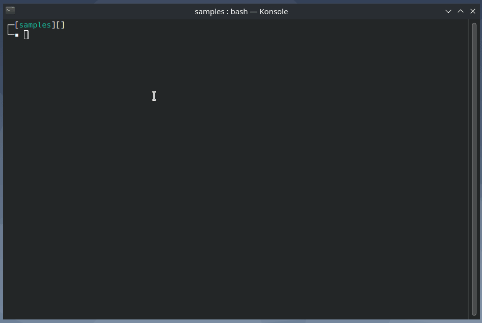
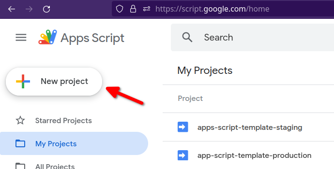
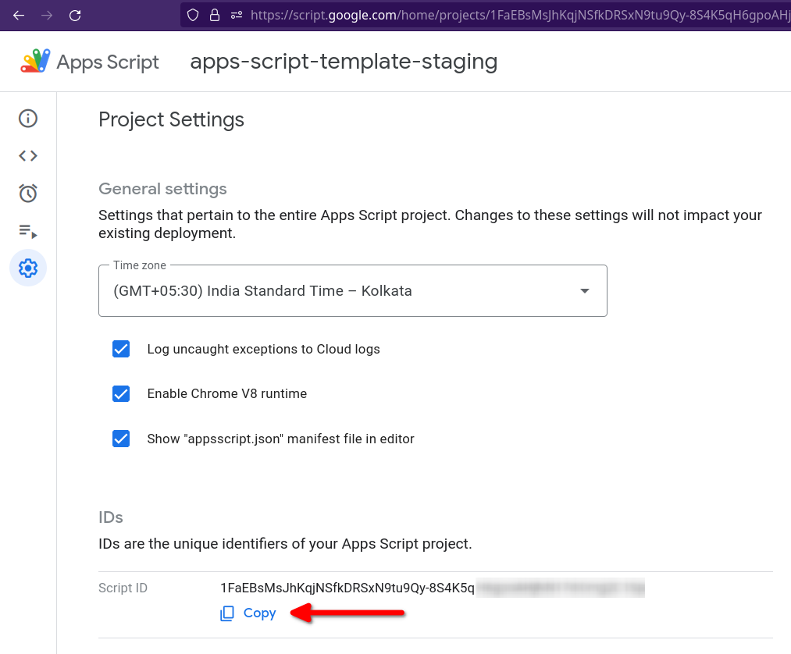
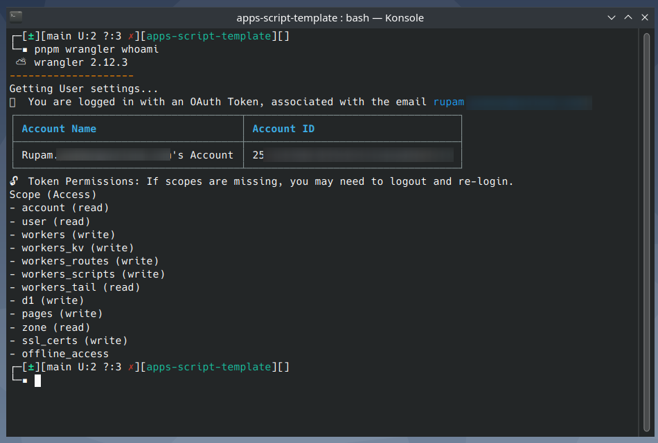
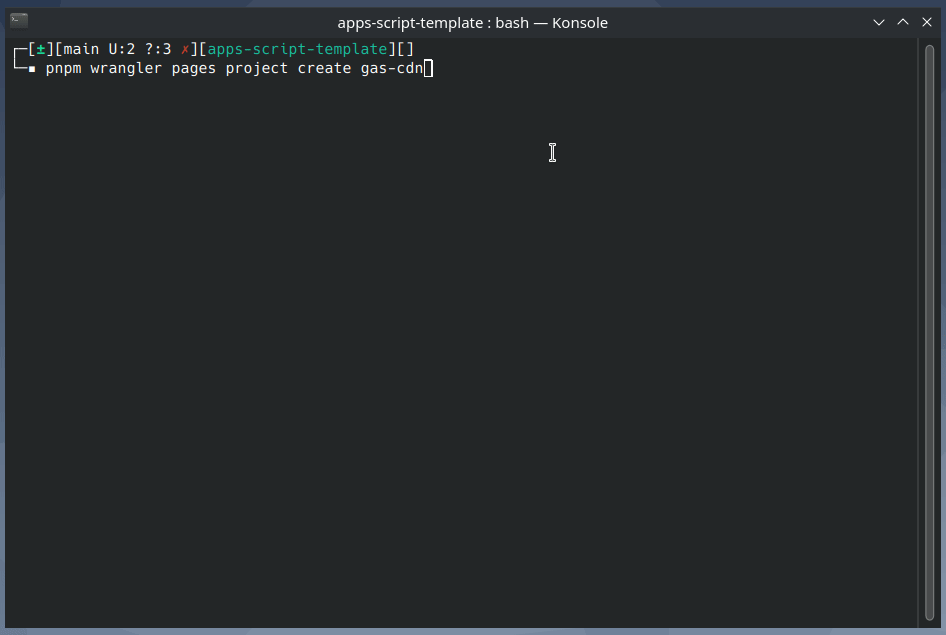
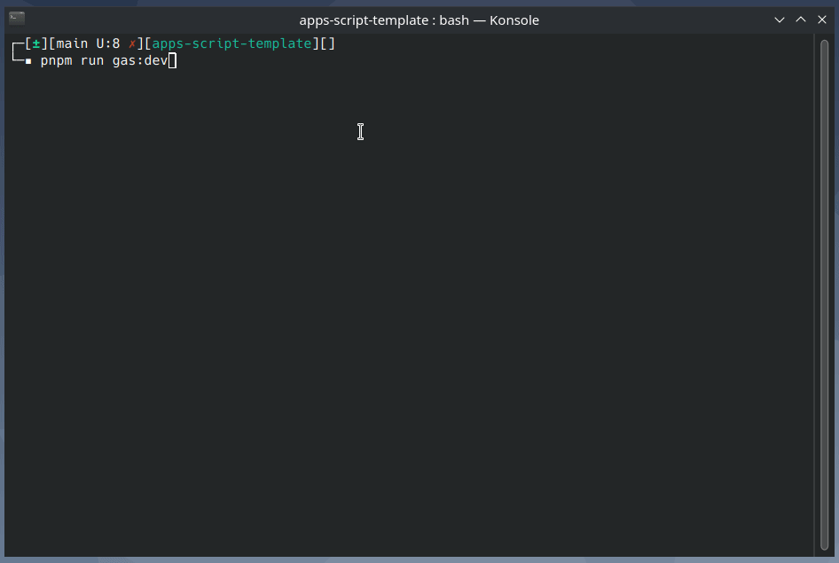

<p align="center">
✨ This is a starter template for Google Apps Script project. Easily develop Google Workspace™ and Editor add-ons for Google Docs, Sheets, Slides etc. Use any frontend framework supported by Vite (React, Vue, Svelte etc.)
</p>

---

- **Note:** This README is a work in progress and may not yet be complete.

---

## Table of Contents

- [Introduction](#introduction)
- [Setup Guide](#setup-guide)
  - [Libraries Used](#libraries-used)
  - [Prerequisites](#prerequisites)
  - [Installation](#installation)
- [Local Development](#local-development)
- [Staging and Production Deployment](#deployment)
- [Authors](#authors)
- [Acknowledgments](#acknowledgements)

<br/>

## Introduction <a name = "introduction"></a>

[Google Apps Script](https://developers.google.com/apps-script) is a cloud-based JavaScript platform that lets you integrate with and automate tasks across Google products.

This repo is a starter template that you can use to build Google Workspace and Editor add-ons directly from Visual Studio Code.

## Setup Guide <a name = "setup-guide"></a>

### Libraries Used <a name = "libraries-used"></a>

This Google Apps Script starter template built using the following tools and libraries

- [pnpm](https://pnpm.io/)
- [Turborepo](https://turbo.build/repo)
- [Rollup](https://rollupjs.org/)
- [Vite](https://vitejs.dev/)
- [Clasp](https://github.com/google/clasp)

### Prerequisites <a name = "prerequisites"></a>

- [NodeJS](https://nodejs.org/en) v16 (v14 not tested)
- [pnpm](https://pnpm.io/) - [installation guide](https://pnpm.io/installation)
- Enable Google Apps Script API. Open [https://script.google.com/home/usersettings](https://script.google.com/home/usersettings) to enable.
- Install [mkcert](https://github.com/FiloSottile/mkcert)

### Installation <a name = "installation"></a>

#### 1. Clone repo

Clone this repository and install the dependencies with pnpm.

```bash
git clone https://github.com/rupampoddar/apps-script-template
cd apps-script-template
pnpm i
```



#### 2. Login to Clasp

Next, login to [Clasp](https://github.com/google/clasp).

```bash
# login
pnpm clasp login

# check status
pnpm clasp login --status
```

#### 3. Setup Gas-backend

Go to `apps/gas-backend` folder and rename the following files:

- `.clasp.development.json.example` ➡️ `.clasp.development.json`
- `.clasp.staging.json.example` ➡️ `.clasp.staging.json`
- `.clasp.production.json.example` ➡️ `.clasp.production.json`

Next, create two Apps Script projects. One for development/staging and another for production.




Copy the _Script ID_ from your staging project and save it in the following files:

- `apps/gas-backend/.clasp.development.json`
- `apps/gas-backend/.clasp.staging.json`

Similarly, copy the _Script ID_ from your production project and save it in the following file:

- `apps/gas-backend/.clasp.production.json`

```json
// example
{
  "scriptId": "1FaEBsMsJhKqjNS...",
  "rootDir": "dist/"
}
```

#### 4. Setup Gas-root folder

Go to `apps/gas-root` folder and rename the following files:

- `.env.example` ➡️ `.env`
- `.env.development.example` ➡️ `.env.development`
- `.env.staging.example` ➡️ `.env.staging`
- `.env.production.example` ➡️ `.env.production`

#### 5. CDN Setup

CDN is used to host and serve gas-frontend assets in staging/production.

This repo is pre-configured to use [Cloudflare Pages](https://pages.cloudflare.com/) as a CDN.

1. Create a Cloudflare account.

2. Next, login to Cloudflare using **Wrangler CLI**.

```bash
# run commands from the project root

# login to cloudflare
pnpm wrangler login

# get account details
pnpm wrangler whoami

```



3. Next, create a new **Cloudflare Pages** project.

```bash
pnpm wrangler pages project create project-name
```



4. Copy your Cloudflare **Account ID** and the **Cloudflare Pages** project name (e.g. `gas-cdn`) and update the file - `apps/gas-cdn/package.json`

```json
// replace YOUR_CF_ACC_ID and CF_PAGES_PROJECT_NAME
{
  "scripts": {
    "deploy:staging": "CLOUDFLARE_ACCOUNT_ID=<YOUR_CF_ACC_ID> wrangler pages publish ./public --project-name=<CF_PAGES_PROJECT_NAME> --branch=main",
    "deploy:production": "CLOUDFLARE_ACCOUNT_ID=<YOUR_CF_ACC_ID> wrangler pages publish ./public --project-name=<CF_PAGES_PROJECT_NAME> --branch=main"
  }
}
```

5. Copy the **Cloudflare Pages** project hostname (e.g. `https://gas-cdn.pages.dev`) and save it in the following files:

- `apps/gas-root/.env.development`
- `apps/gas-root/.env.staging`
- `apps/gas-root/.env.production`

```ini
PUBLIC_CDN_HOST=https://gas-cdn.pages.dev
```

> You can use different **Cloudflare Pages** projects for staging and production. For simplicity I'm using the same project.

## Local Development <a name = "local-development"></a>

From the project root, run the following command

```bash
pnpm run gas:dev
```



Open the apps script project in your browser and create a test deployment.

<video width="100%" controls>
  <source src="./docs/media/test-deployment.mp4" type="video/mp4">
</video>

Now, you can make changes to both `gas-frontend` and `gas-backend` files and it will be synced automatically in the background.

## Staging and Production Deployment <a name = "deployment"></a>

From the project root, run the following command

```bash
pnpm run gas:deploy:staging
```

## Authors <a name = "authors"></a>

- Rupam Poddar [@rupam0x](https://twitter.com/rupam0x)

## Acknowledgments <a name= "acknowledgments"></a>

This project is hugely inspired by and partially adapted from [React-Google-Apps-Script](https://github.com/enuchi/React-Google-Apps-Script). Check it out if you are more comfortable with webpack and npm.
